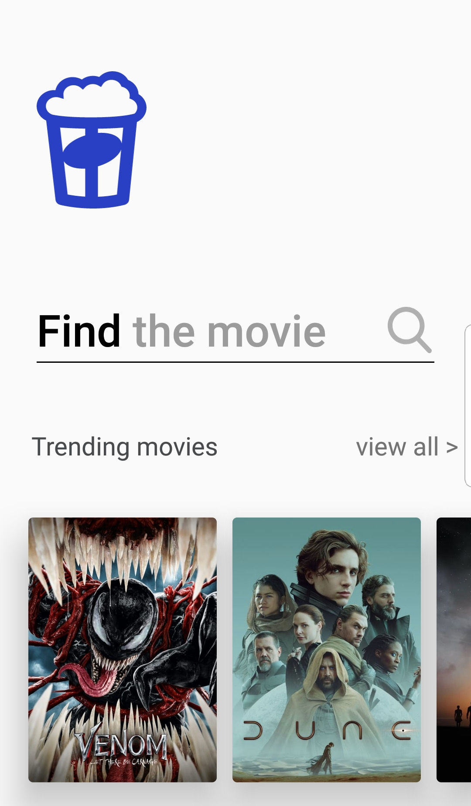

## Overview ##
The app is write in Kotlin using MVVM architecture pattern and Android Jetpack together with other third party libraries .

## Clone & Use ##
https://github.com/catalinpeter/Popcorn.git
You have to add yor "themoviedb" API key in property API_KEY from TmdbApi interface.
"https://developers.themoviedb.org/3/getting-started/introduction"

## App description ##
App allows the user to search for movies using "themoviedatabase" API.

* Main Screen:
The user can enter the name of a movie.
When he press the search key a new screen will open and display the results.
I did input validation in case the seach box is empty.
when the user taps and focus into the search box a suggestion list view is displayed with the last 10 positive successful queries
I have implemented a horizontal list that displays the trending movies from same api.

* Movies Screen:
When the user launches a request, the Movies screen will open and will display the results of the query.
If the api returns an empty list, the application will displays an alert.
I noticed that "themoviedatabase" API offers pagination, so i implemented pagination requests using Android Paging3 library

* Detailes Screen
when the user touches a movie from the list displayed in the Movies Screen, the Detailes Screen will openand and will display the details of the selected movie.

### Components and libraries ###
* Navigation Component
Used for in app navigation and data parsing between components (Fragments)
* ViewModel & LiveData
ViewModel class manage data for Fragments and for configurtion change persistance.
LiveData is use observable data holder class for Paging library stream
* Paging3
The Paging Library helps app to implement pagination that load and display small chunks of data at a time.
* ViewBinding
View binding allows to interacts with views in a more easly manner.
* Hilt
I use Hilt for dependency injection in project
* Glide
I use Glide as image loading framework
* Retrofit/Gson
I use retrofit as a REST client for aplication and Gson for serialization and deserialization of the objects
* SDP/SSP
An android lib that provides a new size unit - sdp/ssp.
I use this library for layouts to scale with diferent screen sizes
https://github.com/intuit/sdp.git
* SharedPrefs-ktx
I use this library to be able to save objects in SharedPreferences for sugestionList persistence
https://github.com/GuilhE/SharedPrefs-ktx/tree/master/converter-gson

### Things to do ###
Save API key in a secure manner.
Handling network and other events.

